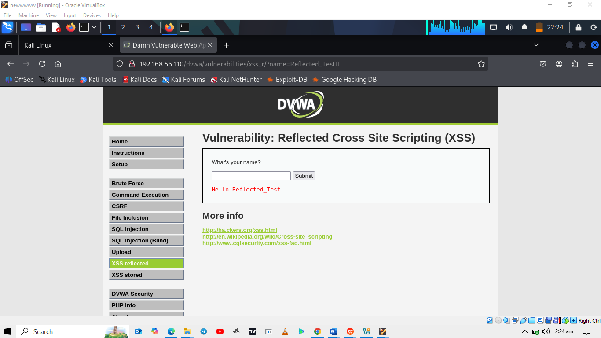
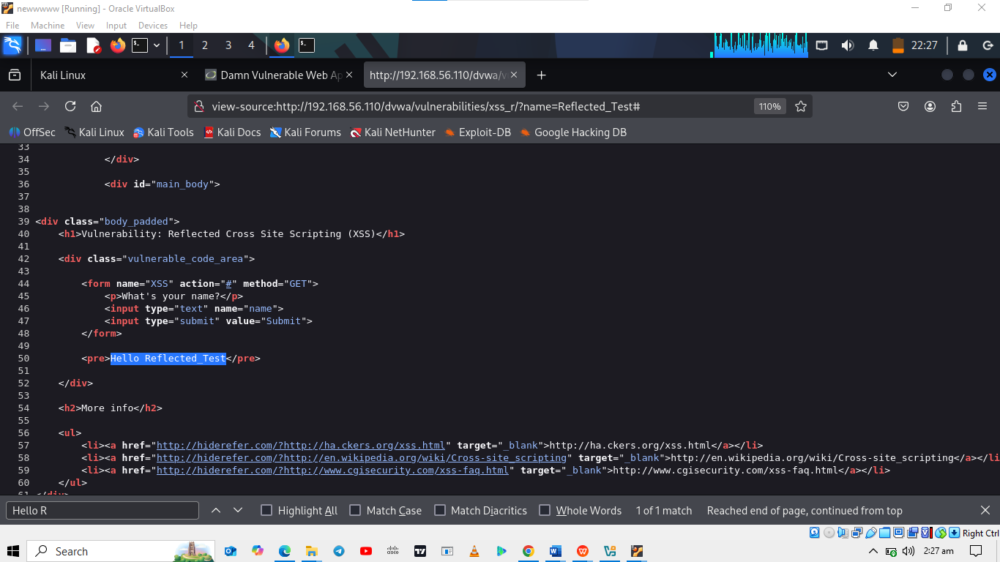
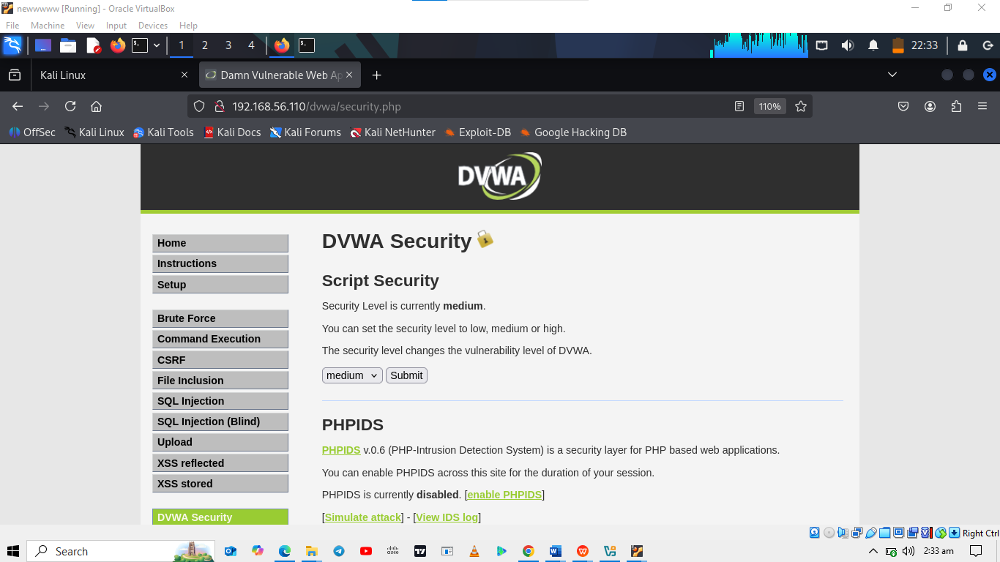
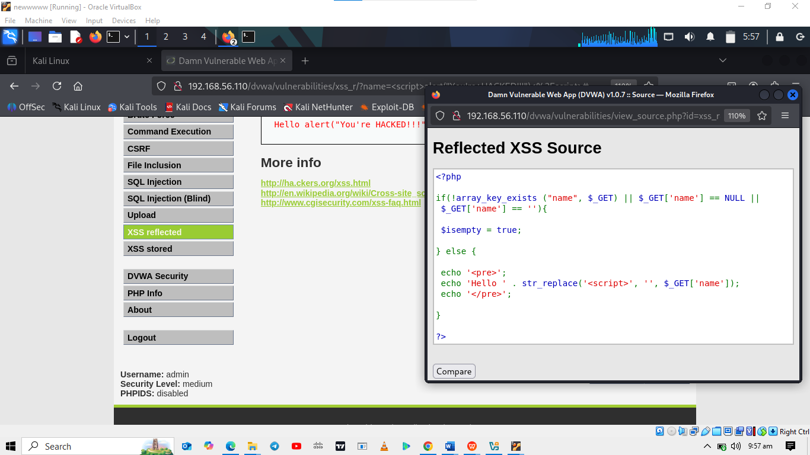
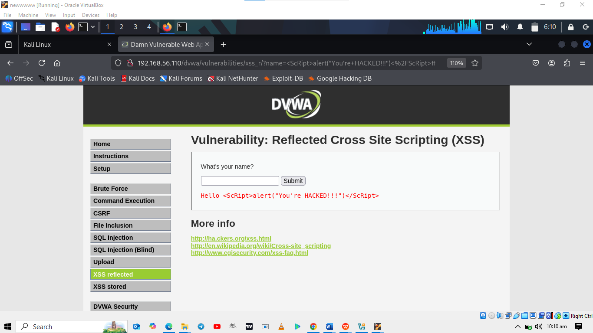
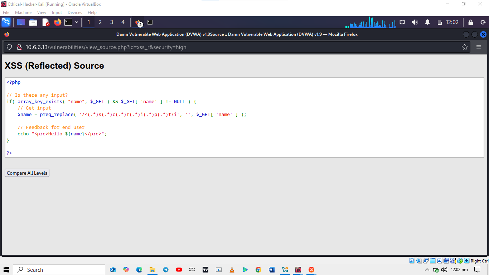
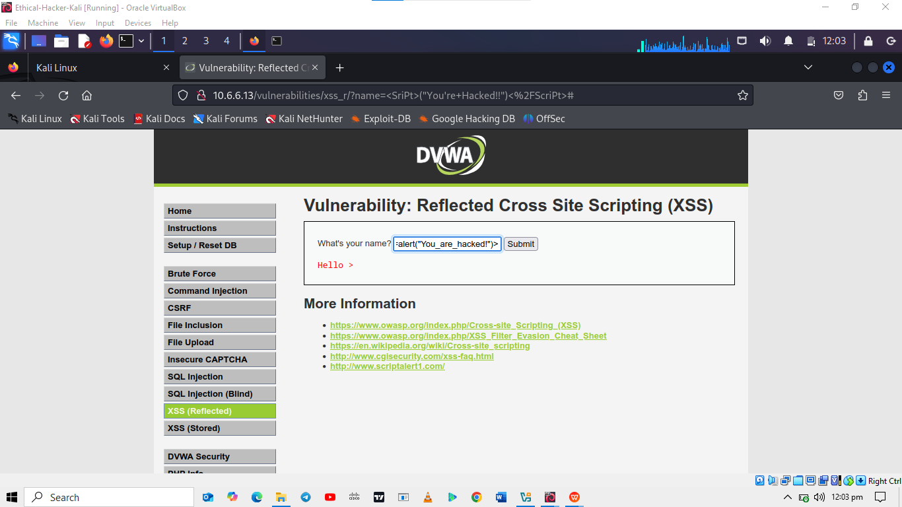
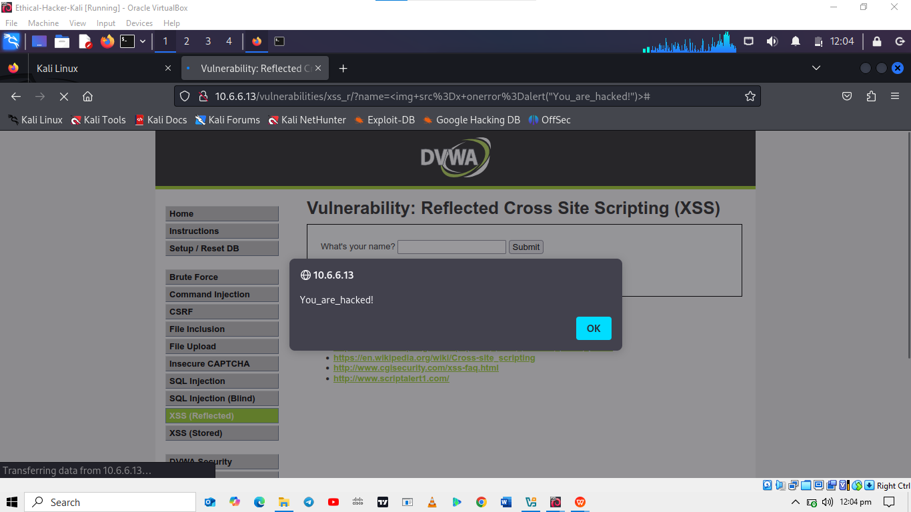

# Cross-Site Scripting (XSS) Lab Documentation

## Overview
This lab involved performing Reflected and Stored Cross-Site Scripting (XSS) attacks against the Damn Vulnerable Web Application (DVWA) at Low, Medium, and High security levels. The objective was to identify and exploit XSS vulnerabilities to understand web application security weaknesses. The lab was conducted using the Kali Linux VM customized for the Cisco Ethical Hacker course, with DVWA accessed at `http://10.6.6.13`. Below is a detailed account of the steps I took and my findings.
Note that, I started with Metasploitable2 before changing to the Ethical Hacker vm.

## Part 1: Reflected Cross-Site Scripting Exploits
Reflected Cross-Site Scripting (XSS) is a type of XSS attack where a malicious script is injected into a web application and immediately reflected back to the user’s browser via a crafted link or form submission. The script is not stored on the server but is embedded in the server’s response, typically through user input fields like search bars or form inputs. When a user clicks a malicious link or submits a vulnerable form, the script executes in their browser, potentially stealing data, redirecting to malicious sites, or performing unauthorized actions. Reflected XSS relies on social engineering, such as phishing, to trick users into triggering the payload.

### Low Security Level
Setup: I logged into DVWA using the credentials admin/password and set the security level to Low via the DVWA Security menu.
  
  
  
  
Initial Test: I navigated to the XSS (Reflected) module, entered Reflected_Test in the "What's your name?" field, and submitted it. The response displayed "Hello Reflected_Test."
  
  
  
  
Source Code Analysis: By viewing the page source (Ctrl+U) and searching for Reflected_Test (Ctrl+F), I confirmed that user input was directly inserted into the page's HTML, indicating a potential XSS vulnerability.
  
  
  
  
Exploit: I entered the payload `` in the input field and submitted it. An alert box with `"You are hacked!"` appeared, confirming the vulnerability. I reloaded the tab and observed the same alert, demonstrating that the malicious script could execute via a crafted link.

  

### Medium Security Level
Setup: I changed the security level to Medium and returned to the XSS (Reflected) module.

  

Initial Attempt: I submitted the same payload ``. No alert appeared, and the script was displayed as literal text, indicating filtering.

  

Source Code Analysis: I reviewed the PHP source code by clicking "View Source." The code used `str_replace('`, using mixed case to bypass the filter. The alert box appeared, confirming the site was still vulnerable at Medium security.

  
  

### High Security Level
Setup: I set the security level to High and accessed the XSS (Reflected) module.

Initial Attempt: I submitted ``. No alert appeared, indicating stronger filtering.

  
  
   
Source Code Analysis: The PHP code used `preg_replace('/<(.*)s(.*)c(.*)r(.*)i(.*)p(.*)t/i', '', $_GET['name'])`, which removed any variation of ` in the Message field. Upon submission, an alert box appeared. Refreshing the page triggered the alert again, confirming the payload was stored and executed on page load.

I reset the database via "Setup / Reset DB" to clear the payload.

### Medium Security Level

I set the security level to Medium and accessed the XSS (Stored) module.

I entered XSS Test#1 in the Name field and Stored XSS Test in the Message field. The source code confirmed the inputs were stored.

I submitted `` in the Message field. No alert appeared, and the script was displayed with HTML tags removed and slashes added before quotes, indicating sanitization.

The PHP code used `strip_tags()` and `htmlspecialchars()` on the Message field to remove HTML tags and escape special characters. The Name field used `str_replace()` to remove ` in the Name field and arbitrary text in the Message field. The alert appeared, confirming a successful bypass. The alert persisted on page refresh.

I reset the database to clear the payload.

### High Security Level

I set the security level to High and accessed the XSS (Stored) module.

I entered `Test#1` in the Name field and Stored XSS Test in the Message field, confirming storage in the page source.

I submitted `` in the Message field. No alert appeared, indicating sanitization.

The Message field used `strip_tags()` and `htmlspecialchars()`, while the Name field used `preg_replace()` to remove any  in the Message field. An alert box displayed the session cookie, confirming the ability to capture sensitive data.

I attempted the same payload at Medium and High levels. At Medium, I bypassed the filter using <ScRipt> in the Name field after modifying maxlength, and the cookie was displayed. At High, I used `<svg onload=alert(document.cookie)>` in the Name field, which also succeeded.

I reset the database after each test.

---

## Reflection

The successful exploitation of XSS vulnerabilities at Low, Medium, and High security levels in DVWA highlighted significant security weaknesses. At Low security, the lack of input sanitization allowed straightforward script injection. At Medium, basic filtering was bypassed with case manipulation or alternative tags. At High, more sophisticated filters were bypassed using non-script tags like  and <svg>. These vulnerabilities suggest that the application is susceptible to other potential exploits, such as session hijacking or phishing via malicious redirects. In an ethical hacking engagement, these findings would prompt a thorough evaluation for additional vulnerabilities and recommendations for robust input validation and sanitization.
