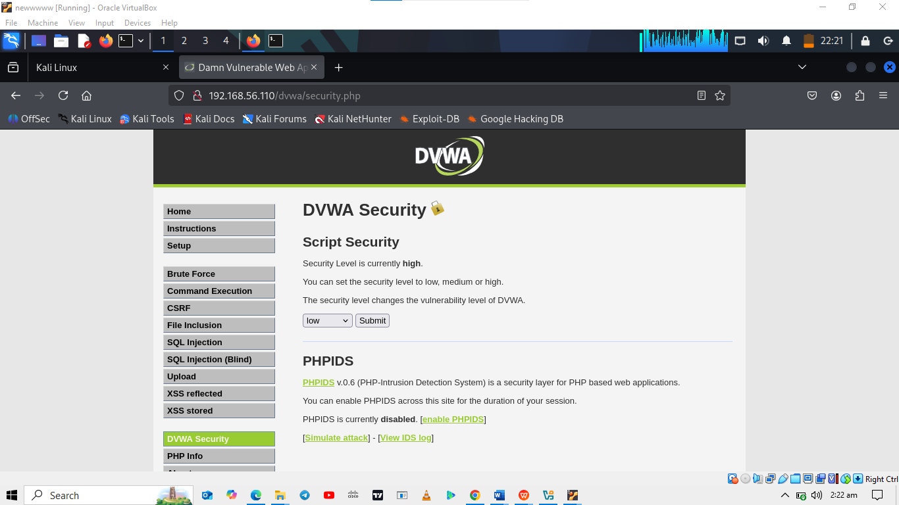
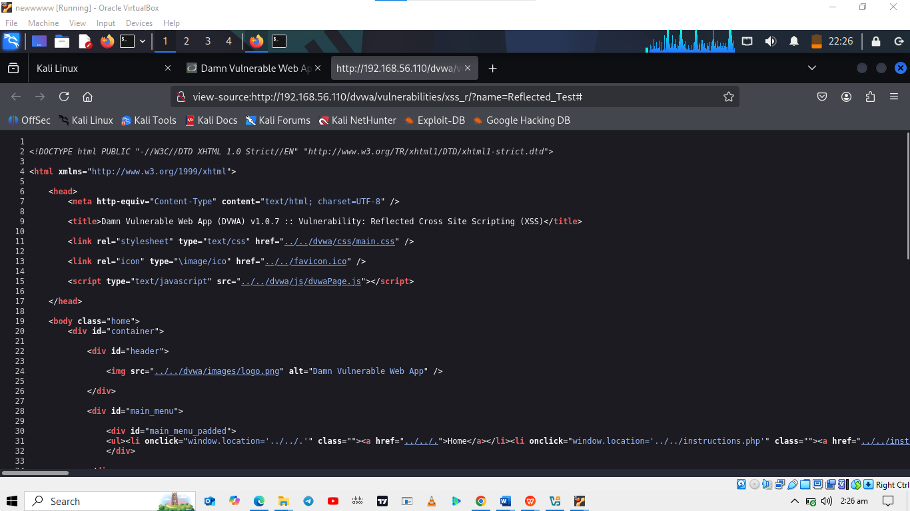

# Cross-Site Scripting (XSS) Lab Documentation

## Overview
This lab involved performing Reflected and Stored Cross-Site Scripting (XSS) attacks against the Damn Vulnerable Web Application (DVWA) at Low, Medium, and High security levels. The objective was to identify and exploit XSS vulnerabilities to understand web application security weaknesses. The lab was conducted using the Kali Linux VM customized for the Cisco Ethical Hacker course, with DVWA accessed at `http://10.6.6.13`. Below is a detailed account of the steps I took and my findings.
Note that, I started with Metasploitable2 before changing to the Ethical Hacker vm.

## Part 1: Reflected Cross-Site Scripting Exploits
Reflected Cross-Site Scripting (XSS) is a type of XSS attack where a malicious script is injected into a web application and immediately reflected back to the user’s browser via a crafted link or form submission. The script is not stored on the server but is embedded in the server’s response, typically through user input fields like search bars or form inputs. When a user clicks a malicious link or submits a vulnerable form, the script executes in their browser, potentially stealing data, redirecting to malicious sites, or performing unauthorized actions. Reflected XSS relies on social engineering, such as phishing, to trick users into triggering the payload.

### Low Security Level
Setup: I logged into DVWA using the credentials admin/password and set the security level to Low via the DVWA Security menu.
  
  
  
  
Initial Test: I navigated to the XSS (Reflected) module, entered Reflected_Test in the "What's your name?" field, and submitted it. The response displayed "Hello Reflected_Test."
  
  
  
  
Source Code Analysis: By viewing the page source (Ctrl+U) and searching for Reflected_Test (Ctrl+F), I confirmed that user input was directly inserted into the page's HTML, indicating a potential XSS vulnerability.
  
  
  
  
- Exploit: I entered the payload `` in the input field and submitted it. An alert box with `"You are hacked!"` appeared, confirming the vulnerability. I reloaded the tab and observed the same alert, demonstrating that the malicious script could execute via a crafted link.
  

### Medium Security Level

